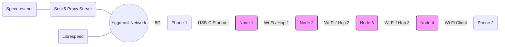

# 2026-08-04 Multi-hop Performance (4 Nodes)
**Goal:** Measure ping, throughput degradation, and video streaming performance across 1, 2, 3, and 4 YggMesh hops.

## Topology


## Environment
### Scenario A: Extreme Range (Total: 190m)
* Node 1: [47.819508, -122.309538](https://www.openstreetmap.org/search?lat=47.819508&lon=-122.309538)
* Node 2: [47.819870, -122.309664](https://www.openstreetmap.org/?mlat=47.81987086344544&mlon=-122.30966431793676)
  * Direct distance from Node 1: 41.34m
* Node 3: [47.820290, -122.309160](https://www.openstreetmap.org/?mlat=47.820290&mlon=-122.309160)
  * Direct distance from Node 2: 59.98m
  * Direct distance from Node 1: 91.42m
  * Accumulated distance from Node 1: 101.32m
* Node 4: [47.821094, -122.309109](https://www.openstreetmap.org/?mlat=47.821094&mlon=-122.309109)
  * Direct distance from Node 3: 89.48
  * Direct distance from Node 2: 142.27
  * Direct distance from Node 1: 179.24
  * Accumulated distance from Node 1: 190.08m

### Scenario B: Optimal Range (Total: 128m)
* Node 1, 2, 3: Same as Scenario A.
* Node 4 (location b): [47.820283, -122.308795](https://www.openstreetmap.org/?mlat=47.820283&mlon=-122.308795)
  * Direct distance from Node 3: 27.26m
  * Direct distance from Node 2: 79.49m
  * Direct distance from Node 1: 102.49m
  * Accumulated distance from Node 1: 128.68m


## Hardware & Firmware
### YggMesh Nodes 1-4
* **Hardware:** [GL.iNet GL-AR300M16](https://www.gl-inet.com/products/gl-ar300m). Bought from [Amazon](https://a.co/d/07d6zejs).
* **Firmware:**
  * **Build command:**
    ```bash
    MESH_ID="yggmesh/mesh" \
    MESH_KEY="qJ7tN2vL8pR4xKcM" \
    YGG_PORT="17000" \
    PRIVATE_SSID="YggMesh<N>" \
    DEFAULT_ROOT_PASSWORD="yggmesh" \
    YGGDRASIL_DNS="308:c8:48:45:: 324:71e:281a:9ed3::53 300:7c75:d590:c5d8::100" \
    YGGDRASIL_PEERS="tcp://ygg1.asriyan.me:23672?maxBackoff=30" \
    ./scripts/build_router.sh ar300m16
    ```
    where `<N>` is replaced with the node number (1, 2, 3, or 4) for each respective node.
  * **Git commit:** [e2de44489cbb29edfe324955b3a041ec619c48f5](https://github.com/ed-asriyan/YggMesh/commit/e2de44489cbb29edfe324955b3a041ec619c48f5)

### Phone 1
* **Hardware:** [Google Pixel 10](https://store.google.com/product/pixel_10)
* **Carrier:** [Helium Mobile](https://heliummobile.com) (which is based on [T-Mobile](https://t-mobile.com) network), 5G

The phone is connected to [Type-C to Ethernet Adapter](#type-c-to-ethernet-adapter), which is connected to [Node 1](#yggmesh-yggmesh-nodes-1-4).

### Phone 2
* **Hardware:** [iPhone 17](https://www.apple.com/iphone-17)
* **Carrier:** no (airplane mode enabled)

The phone is connected to the YggMesh node via Wi-Fi.

### Type-C to Ethernet Adapter
**Hardware:** [BENFEI USB-C to Ethernet Adapter](https://a.co/d/0bH5pHpp)

### Socks5 Proxy App
**App:** [Super Proxy](https://apps.apple.com/us/app/super-proxy-tunnel-your-apps/id6478274781)

### Socks5 iOS Proxy Server
Socks5 server hosted on [Ionos](https://www.ionos.com/) VPS in US.

### Yggdrasil Android Client
**App:** [Yggdrasil Android](https://github.com/yggdrasil-network/yggdrasil-android/releases/tag/v0.1-021) v0.1-021

## Methodology
1. Open [Speedtest](https://speedtest.net) in the browser on [Phone 1](#phone-1) and run the speed test to measure results.
2. Enable [Yggdrasil Client](#yggdrasil-android-client) on [Phone 1](#phone-1), open [LibreSpeed](http://speedtest.odmincheg.ygg) in the browser on [Phone 1](#phone-1) and run the speed test to measure results.
3. Disable [Yggdrasil Client](#yggdrasil-android-client) on [Phone 1](#phone-1).
4. Connect [Phone 1](#phone-1) to [Node 1](#yggmesh-yggmesh-nodes-1-4) via [Type-C to Ethernet Adapter](#type-c-to-ethernet-adapter).
5. Place [4 nodes](#yggmesh-yggmesh-nodes-1-4) in a line, with each node in a radio visibility of the next node. [Node 1](#yggmesh-yggmesh-nodes-1-4) to be connected to [Phone 1](#phone-1) via [Type-C to Ethernet Adapter](#type-c-to-ethernet-adapter).
6. **Verify Routing:** Open LuCI -> Interfaces -> yggdrasil -> peers and verify the Yggdrasil peer list to ensure it has established a link ONLY with its immediate neighbor(s), guaranteeing no hop-skipping.
7. Enable airplane mode on [Phone 2](#phone-2) to ensure it is not connected to any cellular network.
8. For each [node](#yggmesh-yggmesh-nodes-1-4):
   1. Come close to the node with [Phone 2](#phone-2) and connect to the node via Wi-Fi
   2. Open [LibreSpeed](http://speedtest.odmincheg.ygg) in the browser on [Phone 2](#phone-2) and run the speed test to measure results.
   3. Open [Socks5 Proxy App](#socks5-proxy-app) on [Phone 2](#phone-2) and connect to [Socks5 iOS Proxy Server](#socks5-ios-proxy-server).
   4. Open [Speedtest](https://speedtest.net) in the browser on [Phone 2](#phone-2) and run the speed test to measure results.
   5. Run the video test in the Speedtest app/website to measure adaptive bitrate streaming performance (Max Resolution and Initial Load Time).
   6. Disconnect [Phone 2](#phone-2) from the Wi-Fi network.

## Results
### Baseline & Hops 1-3
| Path | Hops | LibreSpeed DL / UL / Ping | Speedtest DL / UL / Ping | Video Test (Max Res) |
| --- | --- | --- | --- | --- |
| Phone1 -> 5G | - | 22.7 Mbit/s / 3.4 Mbit/s / 338 ms | 149 Mbit/s / 3.19 Mbit/s / 21 ms | 2160p |
| Phone 2 -> Node 1 -> [above] | 1 | 2.15 Mbit/s / 1.98 Mbit/s / 280 ms | 2.53 Mbit/s / 1.11 Mbit/s / 300 ms | 1440p |
| Phone 2 -> Node 2 -> [above] | 2 | 1.99 Mbit/s / 1.35 Mbit/s / 277 ms | 2.38 Mbit/s / 1.70 Mbit/s / 137 ms | 1080p |
| Phone 2 -> Node 3 -> [above] | 3 | 2.00 Mbit/s / 0.90 Mbit/s / 304 ms | 1.77 Mbit/s / 0.66 Mbit/s / 155 ms | 1080p |

### Node 4 Scenario A
| Path | Hops | LibreSpeed DL / UL / Ping | Speedtest DL / UL / Ping | Video Test (Max Res) |
| --- | --- | --- | --- | --- |
| Phone 2 -> Node 4 -> [above] | 4 | 0.79 Mbit/s / 0.44 Mbit/s / 465 ms | 0.88 Mbit/s / 0.66 Mbit/s / 315 ms | _test failed_ |

### Node 4 Scenario B
| Path | Hops | LibreSpeed DL / UL / Ping | Speedtest DL / UL / Ping | Video Test (Max Res) |
| --- | --- | --- | --- | --- |
| Phone 2 -> Node 4 -> [above] | 4 | 0.73 Mbit/s / 0.15 Mbit/s / 449 ms | 0.86 Mbit/s / 0.80 Mbit/s / 736 ms | 360p |

## Analysis / Conclusion
The experimental results demonstrate the expected behavior of a multi-hop Wi-Fi mesh network: with each additional hop, the throughput decreases and the latency (ping) increases. 

### 1. Distance and Real-World Usability
The physical distance between nodes dictates what kind of applications the mesh can support:
* **Extreme Distance (Location A - ~190m total):** When Node 4 was placed at the absolute edge of the Wi-Fi range, basic TCP traffic (Speedtest) barely passed through, but the video streaming test completely failed.
* **Optimal Distance (Location B - ~128m total):** By moving Node 4 closer (approx. 27m from Node 3), the connection stabilized. The synthetic Video Test successfully passed for 360p resolution. Real-world testing confirmed this: we were able to comfortably load and watch a YouTube video at 360p.
* **Takeaway:** If someone has an active internet connection within ~130 meters and 2 YggMesh nodes in between, YggMesh can reliably bridge that connection through multiple hops to your device, providing enough bandwidth for basic web browsing and low-resolution video streaming.

### 2. Unplanned Discovery: Android Dual-Interface Gateway
During the setup, an unexpected and highly useful behavior was observed with [Phone 1](#phone-1). The phone automatically connected to [YggMesh Node 1](#yggmesh-nodes-1-4) via Wi-Fi, but because the Wi-Fi network lacked direct internet access, the Android OS kept its 5G cellular connection active simultaneously.

When the Yggdrasil client app was launched on [Phone 1](#phone-1), it successfully discovered multiple peers: one over the cellular internet connection and 2 (same peer, in and out direction) over the local YggMesh Wi-Fi network.

This effectively turned the Android phone into a seamless internet gateway. [Phone 2](#phone-2) (on airplane mode) was able to access Alphis Yggdrasil websites as well as the regular internet (via the SOCKS5 proxy). The resulting traffic path was seamlessly routed as: `iPhone -> YggMesh Node 1 -> Android Yggdrasil App -> 5G`.

This demonstrates that an Android device running the Yggdrasil client may act as an "uplink" for the entire mesh network without requiring any USB/Ethernet cables.
